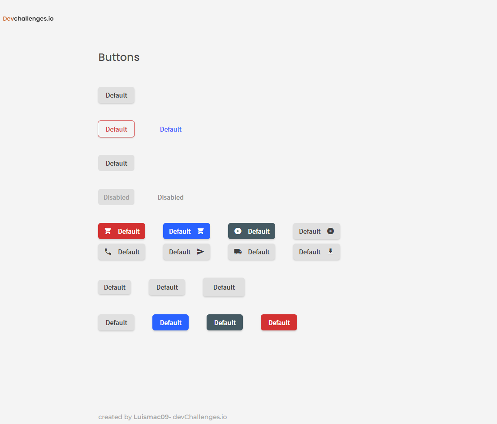

<h1 align="center">Button-Component-master</h1>

   Solution for a challenge from  <a href="http://devchallenges.io" target="_blank">Devchallenges.io</a>.

  <h3>
    <a href="https://button-component-master.netlify.app/">
      Demo
    </a>
     | 
    <a href="https://devchallenges.io/solutions/tT9AEHSXuFsumnyec8YY">
      Solution
    </a>
     | 
    <a href="https://devchallenges.io/challenges/ohgVTyJCbm5OZyTB2gNY">
      Challenge
    </a>
  </h3>

## Table of Contents

- [Overview](#overview)
  - [Built With](#built-with)
- [Features](#features)
- [How to use](#how-to-use)
- [Contact](#contact)
- [Acknowledgements](#acknowledgements)

## Overview

### Built With

- [html](https://developer.mozilla.org/en-US/docs/Web/HTML)
- [css](https://developer.mozilla.org/en-US/docs/Web/CSS)
- [js](https://developer.mozilla.org/en-US/docs/Web/javascript)
- [Vue.js](https://vuejs.org/)
- [vite](https://vitejs.dev/)

## Features

This application/site was created as a submission to a [DevChallenges](https://devchallenges.io/challenges) challenge. The [challenge](https://devchallenges.io/challenges/ohgVTyJCbm5OZyTB2gNY) was to build an application to complete the given user stories.

## Acknowledgements

- [Steps to replicate a design with only HTML and CSS](https://devchallenges-blogs.web.app/how-to-replicate-design/)
- [Node.js](https://nodejs.org/)
- [Marked - a markdown parser](https://github.com/chjj/marked)

## Contact

- GitHub [@luismac09](https://https://github.com/luismac09)
- Twitter [@luismac09](https://twitter.com/Luismac09)
